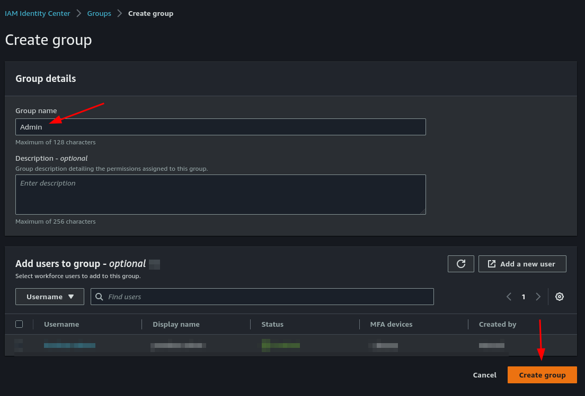

Deploy an *EC2 instance* running a NodeJS Hello-World with *Elasticbeanstalk* and *S3 Bucket*, versionned on *CodeCommit*
===

Introduction
---
Deploying a full environment can be a tedious task with lots of screens to parametrize such as : 

- [S3 Bucket](https://s3.console.aws.amazon.com/s3/buckets?region=eu-west-1#) (to store the application build)
- [CodeCommit](https://eu-west-1.console.aws.amazon.com/codesuite/codecommit/repositories?region=eu-west-1#) (the code repository, like Github)
- [CloudWatch](https://eu-west-1.console.aws.amazon.com/cloudwatch/home?region=eu-west-1#) (for the monitoring, currently not used)
- [Elasticbeanstalk](https://eu-west-1.console.aws.amazon.com/elasticbeanstalk/home?region=eu-west-1#) (the environement and application versions)
- [EC2 Instances](https://eu-west-1.console.aws.amazon.com/ec2/v2/home?region=eu-west-1#Instances:) (the running instance), with its :
    - [Security groups](https://eu-west-1.console.aws.amazon.com/ec2/v2/home?region=eu-west-1#SecurityGroups:)
    - [Load balancers](https://eu-west-1.console.aws.amazon.com/ec2/v2/home?region=eu-west-1#LoadBalancers:)
    - [SSH key pairs](https://eu-west-1.console.aws.amazon.com/ec2/v2/home?region=eu-west-1#KeyPairs:)
    
All this configuration should be treated as code, versionned, checked and deployed like it, as recommanded by Amazon and the Design Pattern [**Infrastructure as Code (IaC)**](https://docs.aws.amazon.com/whitepapers/latest/introduction-devops-aws/infrastructure-as-code.html)

TODO anglais et uploader sur https://learn.lab4tech.ch/mod/page/view.php?id=655
Infrastructure as Code est un Design Pattern, à ne pas confondre avec Infrastructure as a Service (Iaas) qui représente le service offert par Amazon, et pas l'infrastructure du projet lui-même.

IaaS
Infrastructure as a service (IaaS) is a form of cloud computing that provides virtualized computing resources over the internet. IaaS is one of the three main categories of cloud computing services, alongside software as a service (SaaS) and platform as a service (PaaS).

IaC
Practicing infrastructure as code means applying the same rigor of application code development to infrastructure provisioning. All configurations should be defined in a declarative way and stored in a source control system such as AWS CodeCommit or Git, the same as application code. Infrastructure provisioning, orchestration, and deployment should also support the use of the infrastructure as code.

Inconvénients
Tout en ligne de commandes et fichiers de config --> Peut faire peur si on n'a pas l'habitude
Les outils sont mieux implémentés sur Linux (aws, eb, git, ssh, python, ...).
Avantages
Une fois la phase d'initialisation correctement passée...

Plus rapide et facile à
déployer
modifier
détruire
Persister (Git ou AWS CodeCommit)
le code applicatif (webserver)
l'infrastructure elle-même (config, scripts, ...)
Cohérent
On peut répliquer ou adapter un environnement complet
Scaler / Auto-scaler (plus besoin d'upgrader)

Summary
---
To be able to configure and run an environment with CLI you'll have to :

- [Create an AWS Root account](#create-account), enable Organisation, enable SSO
- [Create an Administrator account](#admin-account) on IAM Identity Center
- [Install aws and eb CLI](#install-cli)
- [Configure AWS CLI and SSO](#configure-sso)
- [Initialise GIT](#git-init) (Configure AWS SSO in gitconfig, git init)
- [Create the environment](#create-eb-env) (eb init/create, config files, ssh keys)
- [Configure the environment](#conf-eb-env)
- [Manage the Webapp](#webapp)

<a name="create-account">Creating Accounts</a>
---

**Create an *AWS Root Account*** in the desired Region.

[Doc](https://docs.aws.amazon.com/singlesignon/latest/userguide/get-started-assign-account-access-admin-user.html)

Ireland (*eu-west-1*) is better because it has the most services enabled.

**Create an *Organisation***
[Doc 1](https://docs.aws.amazon.com/organizations/latest/userguide/orgs_introduction.html?org_product_rc_usergude=), [Doc 2](https://docs.aws.amazon.com/organizations/latest/userguide/orgs_manage_org_create.html)

Login as Root User and go to the [AWS Administration Console](https://us-east-1.console.aws.amazon.com/organizations/v2/home/accounts)
Create the organisation (TODO check / screenshot)

From [the CLI](https://docs.aws.amazon.com/cli/latest/reference/organizations/create-organization.html?orgs_product_rc_CLI) (TODO)


<a name="admin-account">**Create an *Administrator User Account***</a>

Login to the [IAM Identity Center](https://eu-west-1.console.aws.amazon.com/singlesignon/identity/home?region=eu-west-1#) (and **not** just [IAM](https://eu-west-1.console.aws.amazon.com/iam/home?region=eu-west-1), [learn the difference](https://docs.aws.amazon.com/singlesignon/latest/userguide/what-is.html) )

Create an *Admin Group*.



Create a *User*, add it to the *Admin group*.


Create a *Predefined Permission set* with **AdministratorAccess**.


Set the *Permission set* to the *Admin Group*.


<a name="install-cli">Install AWS CLI v2 and EB commands</a>
---
[Documentation Amazon](https://docs.aws.amazon.com/cli/latest/userguide/getting-started-install.html)

The official repositories (amongst other things) are included as submodule in the [parent directory](https://github.com/pumbaa666/lab4tech/tree/main/AWS)

```
sudo apt install unzip
pushd /tmp
curl "https://awscli.amazonaws.com/awscli-exe-linux-x86_64.zip" -o "awscliv2.zip"
unzip awscliv2.zip
sudo ./aws/install
popd

# Add eb commands (Elasticbeanstalk) to the PATH
echo 'export PATH="/home/$USER/.ebcli-virtual-env/executables:$PATH"' >> ~/.bash_profile
source ~/.bash_profile
eb status
```

<a name="configure-sso">Configuring SSO (Single Sign On)</a>
---
[SSH Key pair documentation](https://docs.aws.amazon.com/AWSEC2/latest/UserGuide/replacing-key-pair.html)

**Configure your session by login in**

Login to the [IAM Identity Center](https://eu-west-1.console.aws.amazon.com/singlesignon/identity/home?region=eu-west-1#) with your **Root Account**, go to *Settings*, tab *Identity Source* and note the **AWS access portal URL**, it's your *SSO start URL*.


Logout from this account and run the following commands :

```
aws configure # Only set Region name. Key ID and Access Key are deprecated and will be managed by `aws configure sso`
    AWS Access Key ID [None]: 
    AWS Secret Access Key [None]: 
    Default region name [None]: eu-west-1
    Default output format [None]:

aws configure sso
    # Chose whatever you want
    SSO session name : admin-session
    
    # Given in the Settings of the IAM Identity Center
    SSO start URL : https://d-9367506e20.awsapps.com/start
    
    # Your default region 
    region : eu-west-1
    
    # Let the default
    SSO registration scopes : sso:account:access
```

When the browser starts login with your **User Account** (not the Root account, here *user-account*) and accept the permissions.

the config will be saved in your home
```
cat ~/.aws/config
    [profile user-account]
    sso_session = admin-session
    sso_account_id = 385324514552
    sso_role_name = AdministratorAccess
    region = eu-west-1
    [sso-session admin-session]
    sso_start_url = https://d-9367506e20.awsapps.com/start
    sso_region = eu-west-1
    sso_registration_scopes = sso:account:access
```

the CLI and SSO session are cached in the same folder
```
ls -lh ~/.aws/*
    /home/user/.aws/cli:
    drwxrwxr-x 2 user user 4.0K Apr 24 16:54 cache

    /home/user/.aws/sso:
    drwxrwxr-x 2 user user 4.0K Apr 24 13:57 cache
```

To use this profile, specify the profile name using --profile with every command.

i.e :
```
aws s3 ls --profile user-account
aws s3 rm s3://elasticbeanstalk-eu-west-1-385324514552/ --profile user-account
```

<a name="configure-sso-terminal">Set up SSO in terminal (CLI)</a>
---
Alternatively you can set some **environment variables** (env. var.) to get rid of the `--profile` parameter.

Run at least one CLI command with the `--profile` parameter, it will generate the credentials in `~/.aws/cli/cache/FILE.json`

and then run the following commands :

```
aws s3 ls --profile user-account
cliCacheFolder=~/.aws/cli/cache/
cliConfigFileName=$(ls -rt $cliCacheFolder | head -n 1)
cliConfigPath=$cliCacheFolder$cliConfigFileName # absolute file path
echo -e "\nPaste the following lines into the terminal where you want to execute aws commands"
echo "################################################################"
echo "#export PATH='/home/$USER/.ebcli-virtual-env/executables:$PATH\' >> ~/.bash_profile"
echo "source ~/.bash_profile"
echo "export AWS_ACCESS_KEY_ID=$(jq ".Credentials.AccessKeyId" $cliConfigPath)"
echo "export AWS_SECRET_ACCESS_KEY=$(jq ".Credentials.SecretAccessKey" $cliConfigPath)"
echo "export AWS_SESSION_TOKEN=$(jq ".Credentials.SessionToken" $cliConfigPath)"
echo "aws s3 ls"
echo -e "################################################################\n"
```
Copy/past the result in the terminal you want to use the CLI commands from.

You can invoke this script by running `./scripts-infra/refresh-sso-token.sh --profile user-account --skip-login`.

Omit the `--skip-login` parameter if you have to relog to the SSO (once every 24 hours).


<a name="git-init">**Configure git to use AWS credentials**</a>
```
vi ~/.gitconfig
    [user]
        name = Loic Correvon
        email = your-email@email.com
    [credential]
        helper = !aws codecommit credential-helper $@
        UseHttpPath = true
```
TODO gérer les multi-comptes github

**Create new env from local src code**

```
cd aws-hello-world-node
git init --initial-branch=main
git add -A
git commit -m "First commit after eb create (CLI)"
git push
```

**Initialize the Elasticbeanstalk environment with prompt**

[It seems](https://docs.aws.amazon.com/elasticbeanstalk/latest/dg/eb3-init.html) we can't do it without being prompted : _The init command prompts you to provide values for eb init command options that do not have a (default) value..._

When creating a SSH key pair, note the SSH passphrase, you'll need it later.

If you already have a SSH key-pair, add the following parameter to the command : `--keyname aws-eb`

If you already have a CodeCommit repository, add the following parameter to the command : `--source codecommit/repository-name/branch-name`
```
eb init hello-world-app --platform node.js-18
    Region : 4 (Ireland)
    Application to use : 2 (create new app)
    Application name : hello-world-app
    Is this node ? : Y
    Plateform : 1 (Node.js 18)
    CodeCommit : Y
    Repository name : helloworld-node
    Branche Name : main
    Set up SSH : Y
    Select a keypair : 1 (create a new key pair)
```

TODO tester. Si ça marche, retirer le "It seems" ci-dessus.
```
eb init hello-world-app --platform node.js-18 --keyname aws-eb --source codecommit/repository-name/branch-name
```

**Use local files as source code**

[Doc 1](https://stackoverflow.com/questions/64363112/codecommit-fails-when-after-commit-rewrite-with-amend), [Doc 2](https://docs.aws.amazon.com/elasticbeanstalk/latest/dg/eb3-codesource.html)

`eb codesource local`

**Enable *ACL*** ([stackoverflow](https://stackoverflow.com/questions/70333681/for-an-amazon-s3-bucket-deployment-from-github-how-do-i-fix-the-error-accesscont))

Login to [AWS S3 Bucket](https://s3.console.aws.amazon.com/s3/buckets?region=eu-west-1#)
Select the S3 bucket created with *eb create*, tab *Permission*, box *Object Ownership* and enable *ACL*.


**Deploy the Elasticbeanstalk environment with prompt**

[Doc](https://docs.aws.amazon.com/elasticbeanstalk/latest/dg/eb3-create.html)

```
eb create
    Environment Name : Default (hello-world-app-dev)
    DNS CNAME prefix : Default (hello-world-app-dev)
    Loadbalancer : 1 (classic)
    Enable Spot Fleet : N
```

**... or without prompt**

```
eb create dev-env --branch_default \
    --instance_type t3.micro --platform node.js-18 \
    --min-instances 1 --max-instances 2 \
    --region eu-west-1 \
    --elb-type network \
    --cname hello-world \
    --keyname aws-eb \
    --tags environment=test
```
or run the `./scripts-infra/create-eb.sh` with your custom values.

It will build the application and upload it as a .zip to your [S3 Bucket](https://s3.console.aws.amazon.com/s3/buckets?region=eu-west-1#).

<a name="conf-eb-env">**Configure the environment**</a>
---
Some configuration have to be stored in the `.ebextensions` folder at the root of the webapp directory

and some in the `.platform`.

The `.elasticbeanstalk` folder will contain the config of your last terminal session. This is also where the log are retrieved with the `eb logs` command.

[For example](https://aws.amazon.com/blogs/compute/introducing-a-new-generation-of-aws-elastic-beanstalk-platforms/), a NodeJS webserver bundle might look like:
```
hello-world-infra/
├── .ebextensions/
│   └── network-load-balancer.config
├── .elasticbeanstalk/
│   ├── logs/
│   └── config.yml
├── .platform/
│   ├── hooks/
│   │   ├── prebuild/
│   │   │   ├── 01_a-script.sh
│   │   │   └── 10_another-script.sh
│   │   └── predeploy/
│   │   │   └── 01_script-again.sh
│   │   ├── postdeploy/
│   │   │   └── 99_last-script.sh
│   └── nginx/
│       └── conf.d/
│           └── elasticbeanstalk
│               └── 00_application.conf
├── src/
│   └── app.js
└── package.json
```

**Load Balancer**

Create a file named `.ebextensions/network-load-balancer.config` and set the network-type and the exposed port of the NodeJS webapp.
```
vi .ebextensions/network-load-balancer.config
    option_settings:
    aws:elasticbeanstalk:environment:
        LoadBalancerType: network
    aws:elasticbeanstalk:environment:process:nodejs:
        Port: 1337
        Protocol: TCP
        HealthCheckInterval: 30
```

**Nginx**

To configure the nginx reverse proxy create a file named `.platform/nginx/conf.d/elasticbeanstalk/00_application.conf` and set the proxy_pass with the webapp port.

It will redirect incoming traffic from port 80 to the port 1337, maped to the process running the service `web.service`.
```
vi .platform/nginx/conf.d/elasticbeanstalk/00_application.conf
    location / {
        proxy_pass          http://127.0.0.1:1337;
    }
```
That will override the elasticbeanstalk nginx conf on the machine under `/etc/nginx/conf.d/elasticbeanstalk/conf.d/00_application.conf`.

The root config of nginx `/etc/nginx/nginx.conf` is set to enable all conf files under `conf.d/elasticbeanstalk/` subfolder.
```
eb ssh # To SSH on the host machine
cat /etc/nginx/nginx.conf
    server {
        listen        80 default_server;
        include conf.d/elasticbeanstalk/*.conf; # Include the Elastic Beanstalk generated locations
    }
```

If you want to completely override the default nginx conf, rename the file `.platform/nginx/ngnix.conf.default` to `ngnix.conf`.

**Configure some environment variables**

[Doc 1](https://stackoverflow.com/questions/11211007/how-do-you-pass-custom-environment-variable-on-amazon-elastic-beanstalk-aws-ebs), [Doc 2](https://docs.aws.amazon.com/elasticbeanstalk/latest/dg/configuring-https-elb.html)

TODO


Deploying the app
---

<a name="webapp">**Manage the WebApp**</a>
---

**Retrieve the logs**

`eb logs --all`

It will download them locally under `/.elasticbeanstalk/logs/latest/`

The content of `eb-engine.log` shows all the initialisation operations :

- Retrieving the content of the S3 bucket.
- Downloading the application as a zip (uploaded with `eb create`) and extracting it.
- Installing Node.
- Installing the Node dependencies of the webapp.
- Starting the webapp.

**SSH log in to your new env**

With the EB built-in command (you won't have to know the Public IPv4 address)
```
eb ssh # Enter the passphrase of the SSH Key you created at "eb init"
```

or with default `ssh` command or any other, like `sshrc`.

Get your aws key-pair from your `~/.ssh/` folder and the Public IPv4 address of the instance [from the dashboard](https://eu-west-1.console.aws.amazon.com/ec2/v2/home?region=eu-west-1#Instances:) or in CLI with `describe-instance`.

```
EC2USER="ec2-user" # Hardcoded on amazon. (Maybe editable ?)

ls ~/.ssh/ | grep aws | grep .pub
# AWS_PUBLIC_KEY="~/.ssh/aws-eb.pub"
AWS_PUBLIC_KEY=$(ls ~/.ssh/ | grep aws | grep .pub)

# EC2_IP="34.252.159.221"
EC2_IP=$(aws ec2 describe-instances --query 'Reservations[*].Instances[*].PublicIpAddress' --output text)

# ssh -i ~/.ssh/aws-eb.pub ec2-user@34.252.159.221
ssh -i $AWS_PUBLIC_KEY $EC2USER@$EC2_IP
```

**Show, stop and restart the webapp**

The node webapp is automatically started as a daemon with user `webapp`.

It also starts a nginx service listening on port 80 and all conf files under `conf.d/elasticbeanstalk/` subfolder.

We overrid it in the [configuration section](#conf-eb-env) to redirect traffic from port 80 (internet) to 1337 (NodeJS).


```
sudo su -i # Log to root

systemctl list-unit-files
cat /etc/systemd/system/web.service
systemctl status web.service
    # ● web.service - This is web daemon
    # Loaded: loaded (/etc/systemd/system/web.service; enabled; vendor preset: disabled)
    # Active: active (running) since Fri 2023-05-05 13:39:26 UTC; 2 days ago
    # Main PID: 31219 (npm start)
    # CGroup: /system.slice/web.service
    #      ├─31219 npm start
    #      └─31234 node src/app.js
#systemctl stop web
#systemctl restart web

wget -nv -q -O - http://<YOUR_PUBLIC_IPV4_DNS>:1337 # i.e. http://ec2-34-252-159-221.eu-west-1.compute.amazonaws.com:1337
```

**Update the configuration**

Deploy your local changes, without having to commit them (for testing, debuging and developing purpose)

`eb deploy --staged`

Deploy to prod.

`eb deploy`


**To terminate the environment**

`eb terminate`

Examples why IaC is usefull
---
**Duplicate an environnement in another region**
```
# change eu-west-1 into us-east-2 in .elasticbeanstalk/config.yml
vi .elasticbeanstalk/config.yml
    default_region: us-east-1
# eb create ??
eb deploy --stage
eb health
```
