Deploy an *EC2 instance* running a NodeJS Hello-World with *Elasticbeanstalk* and *S3 Bucket*, versionned on *CodeCommit*
===

Summary (TODO)
---
Create a Root account, enable Organisation, enable SSO.
Create an Administrator account on IAM Identity Center.
Install aws and eb CLI.
Configure AWS CLI and SSO.
Initialise GIT (Configure AWS SSO in gitconfig, git init)
eb init and eb create (with correct .ebextensions config files).

Creating Accounts
---

**Create an *AWS Root Account*** in the desired Region.
[Doc](https://docs.aws.amazon.com/singlesignon/latest/userguide/get-started-assign-account-access-admin-user.html)
Ireland (*eu-west-1*) is better because it has the most services enabled.

**Create an *Organisation*** ([Doc 1](https://docs.aws.amazon.com/organizations/latest/userguide/orgs_introduction.html?org_product_rc_usergude=), [Doc 2](https://docs.aws.amazon.com/organizations/latest/userguide/orgs_manage_org_create.html))
Login as Root User and go to the [AWS Administration Console](https://us-east-1.console.aws.amazon.com/organizations/v2/home/accounts)
Create the organisation (TODO check / screenshot)
From [the CLI](https://docs.aws.amazon.com/cli/latest/reference/organizations/create-organization.html?orgs_product_rc_CLI) (TODO)

**Create an *Administrator User Account***

Login to the [IAM Identity Center](https://eu-west-1.console.aws.amazon.com/singlesignon/identity/home?region=eu-west-1#) (and **not** just [IAM](https://eu-west-1.console.aws.amazon.com/iam/home?region=eu-west-1), [learn the difference](https://docs.aws.amazon.com/singlesignon/latest/userguide/what-is.html) )

Create an *Admin Group*.
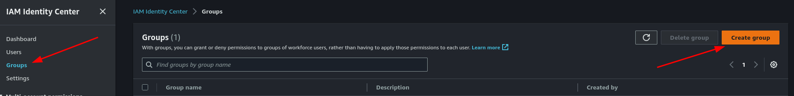
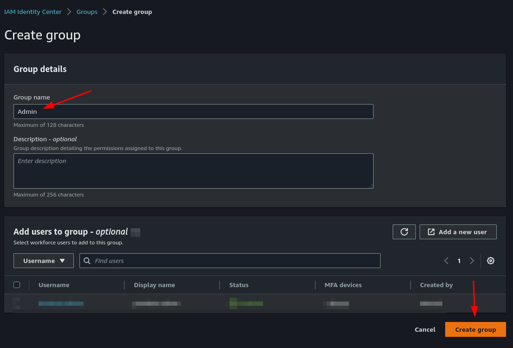

Create a *User*, add it to the *Admin group*.
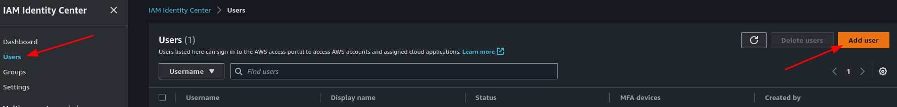
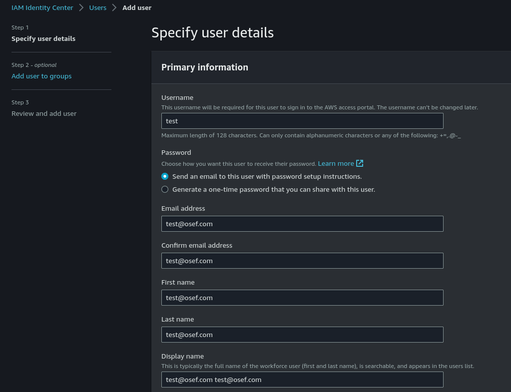
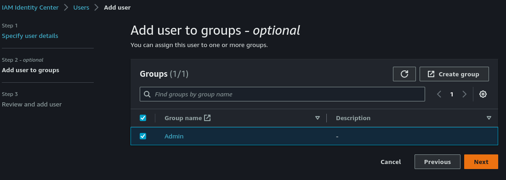

Create a *Predefined Permission set* with **AdministratorAccess**.
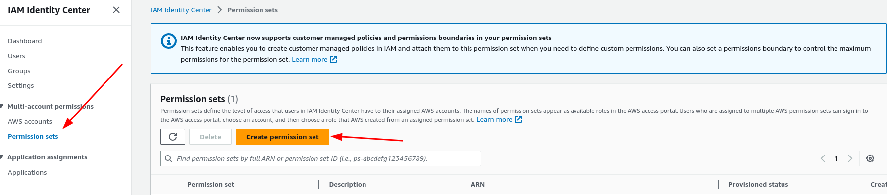
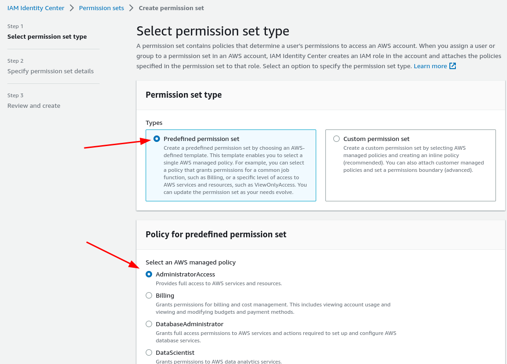
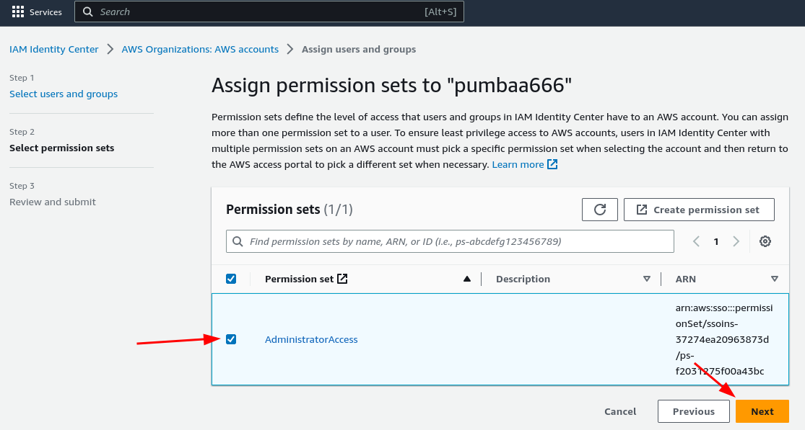

Set the *Permission set* to the *Admin Group*.
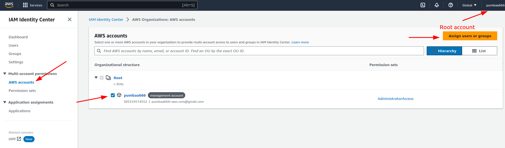
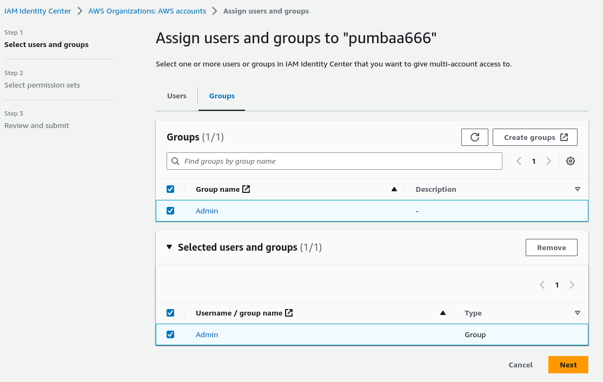

Install AWS CLI v2 and EB commands
---
[Doc](https://docs.aws.amazon.com/cli/latest/userguide/getting-started-install.html)
```
sudo apt install unzip
pushd /tmp
curl "https://awscli.amazonaws.com/awscli-exe-linux-x86_64.zip" -o "awscliv2.zip"
unzip awscliv2.zip
sudo ./aws/install
popd

# Add eb commands (Elasticbeanstalk) to the PATH
echo 'export PATH="/home/$USER/.ebcli-virtual-env/executables:$PATH"' >> ~/.bash_profile && source ~/.bash_profile
```


Configuring SSO (Single Sign On)
---

**Configure your session by login in**
Login to the [IAM Identity Center](https://eu-west-1.console.aws.amazon.com/singlesignon/identity/home?region=eu-west-1#) with your **Root Account**, go to *Settings*, tab *Identity Source* and note the **AWS access portal URL**, it's your *SSO start URL*.
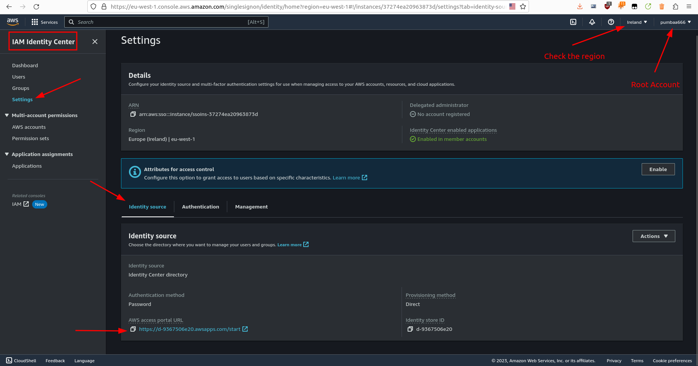

Logout from this account and run the following commands :

```
aws configure # Only set Region name. Key ID and Access Key are deprecated and will be managed by `aws configure sso`
    AWS Access Key ID [None]: 
    AWS Secret Access Key [None]: 
    Default region name [None]: eu-west-1
    Default output format [None]:

aws configure sso
    # Chose whatever you want
    SSO session name : admin-session
    
    # Given in the Settings of the IAM Identity Center
    SSO start URL : https://d-9367506e20.awsapps.com/start
    
    # Your default region 
    region : eu-west-1
    
    # Let the default
    SSO registration scopes : sso:account:access
```

When the browser starts login with your **User Account** (not the Root account, here *user-account*) and accept the permissions.

the config will be saved in your home
```
cat ~/.aws/config
    [profile user-account]
    sso_session = admin-session
    sso_account_id = 385324514552
    sso_role_name = AdministratorAccess
    region = eu-west-1
    [sso-session admin-session]
    sso_start_url = https://d-9367506e20.awsapps.com/start
    sso_region = eu-west-1
    sso_registration_scopes = sso:account:access
```

the CLI and SSO session are cached in the same folder
```
ls -lh ~/.aws/*
    /home/user/.aws/cli:
    drwxrwxr-x 2 user user 4.0K Apr 24 16:54 cache

    /home/user/.aws/sso:
    drwxrwxr-x 2 user user 4.0K Apr 24 13:57 cache
```

To use this profile, specify the profile name using --profile with every command.

i.e :
```
aws s3 ls --profile user-account
aws s3 rm s3://elasticbeanstalk-eu-west-1-385324514552/ --profile user-account
```

Alternatively you can set some **environment variables** (env. var.) to get rid of the *--profile* parameter.
Run at least one CLI command with the *--profile* parameter, it will generate the credentials in ~/.aws/cli/cache/FILE.json
and then run the following commands :

```
aws s3 ls --profile user-account
cliCacheFolder=~/.aws/cli/cache/ # aws default cache folder
cliCacheFile=$(ls -rt $cliCacheFolder | head -n 1) # CLI config file name
cliCacheFile=$cliCacheFolder$cliCacheFile # absolute file path
echo -e "\nPaste the following lines into the terminal where you want to execute aws commands"
echo "################################################################"
echo "#export PATH='/home/$USER/.ebcli-virtual-env/executables:$PATH\' >> ~/.bash_profile"
echo "source ~/.bash_profile"
echo "export AWS_ACCESS_KEY_ID=$(jq ".Credentials.AccessKeyId" $cliCacheFile)"
echo "export AWS_SECRET_ACCESS_KEY=$(jq ".Credentials.SecretAccessKey" $cliCacheFile)"
echo "export AWS_SESSION_TOKEN=$(jq ".Credentials.SessionToken" $cliCacheFile)"
echo "aws s3 ls"
echo -e "################################################################\n"
```
Copy/past the result in the terminal you want to use the CLI commands from.


Configure the environment
---
TODO
Create a `.ebextensions` folder at the root of the webapp directory.
Put some config files named `WHATEVER_YOU_WANT.config`
To configure the nginx reverse proxy :
```
vi .ebextensions/redirect-internet-to-node.config 
    files:
    "/etc/nginx/conf.d/elasticbeanstalk/nginx.conf":
        mode: "000644"
        owner: root
        group: root
        source: "config/nginx.conf"
```
That will copy the content of the local file `./config/nginx.conf` to the machine under `/etc/nginx/conf.d/elasticbeanstalk/nginx.conf`.
The root config of nginx `/etc/nginx/nginx.conf` is set to enable all conf files under `conf.d/elasticbeanstalk/` subfolder.
```
cat /etc/nginx/nginx.conf
    server {
        listen        80 default_server;
        include conf.d/elasticbeanstalk/*.conf; # Include the Elastic Beanstalk generated locations
    }
```


Deploying the app
---

**Configure git to use AWS credentials**
```
vi ~/.gitconfig
    [user]
        name = Loic Correvon
        email = pumbaa666+aws.com@gmail.com
    [credential]
        helper = !aws codecommit credential-helper $@
        UseHttpPath = true
```
TODO gérer les multi-comptes github

**Create new env from local src code**
```
cd aws-hello-world-node
git init --initial-branch=main
git add -A
git commit -m "First commit after eb create (CLI)"
git push
```

**Initialize the Elasticbeanstalk environment with prompt**

[It seems](https://docs.aws.amazon.com/elasticbeanstalk/latest/dg/eb3-init.html) we can't do it without being prompted : _The init command prompts you to provide values for eb init command options that do not have a (default) value..._

```
eb init hello-world-app --platform node.js-18
    Region : 4 (Ireland)
    Application to use : 2 (create new app)
    Application name : hello-world-app (TODO remove ??)
    Is this node ? : Y (TODO remove ??)
    Plateform : 1 (Node.js 18) (TODO remove ??)
    CodeCommit : Y (TODO remove ??)
    Repository name : helloworld-node
    Branche Name : main
    Set up SSH : Y
    Select a keypair : 1 (aws-eb) (TODO tuto pour la créer)
    
# Please note the SSH passphrase, you'll need it later
# If you already have a SSH key-pair, add the following parameter to the command : --keyname aws-eb-re
# If you already have a CodeCommit repository, add the following parameter to the command : --source codecommit/repository-name/branch-name
```

**Use local files as source code**
[Doc 1](https://stackoverflow.com/questions/64363112/codecommit-fails-when-after-commit-rewrite-with-amend)
[Doc 2](https://docs.aws.amazon.com/elasticbeanstalk/latest/dg/eb3-codesource.html)
`eb codesource local`

**Deploy the Elasticbeanstalk environment with prompt**
[Doc](https://docs.aws.amazon.com/elasticbeanstalk/latest/dg/eb3-create.html)

```
eb create
    Environment Name : Default (hello-world-app-dev)
    DNS CNAME prefix : Default (hello-world-app-dev)
    Loadbalancer : 1 (classic)
    Enable Spot Fleet : N
```
If it fails due to ACL restriction, enable ACL (see next section).
    
**... or without prompt**
```
eb create dev-env --branch_default \
    --instance_type t3.micro --platform node.js-18 \
    --min-instances 1 --max-instances 2 \
    --region eu-west-1 \
    --elb-type network \
    --cname hello-world \
    --keyname aws-eb-re \
    --tags environment=test
```

It will zip the application and upload it to your S3 Bucket.

**Enable *ACL*** ([stackoverflow](https://stackoverflow.com/questions/70333681/for-an-amazon-s3-bucket-deployment-from-github-how-do-i-fix-the-error-accesscont))
Login to [AWS S3 Bucket](https://s3.console.aws.amazon.com/s3/buckets?region=eu-west-1#)
Select the S3 bucket created with *eb create*, tab *Permission*, box *Object Ownership* and enable *ACL*.
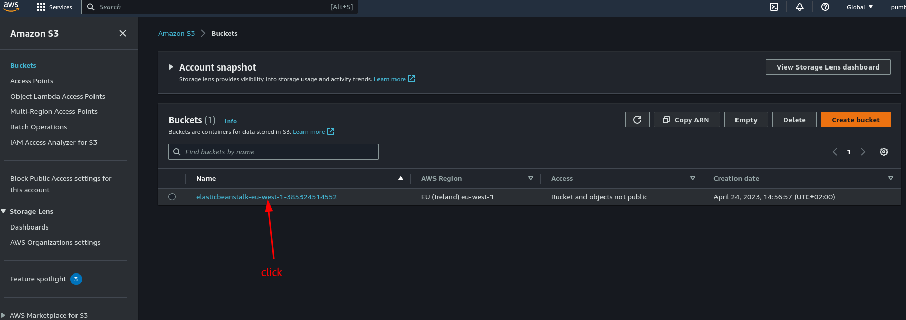
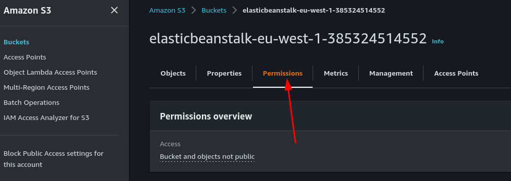
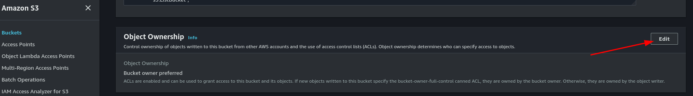
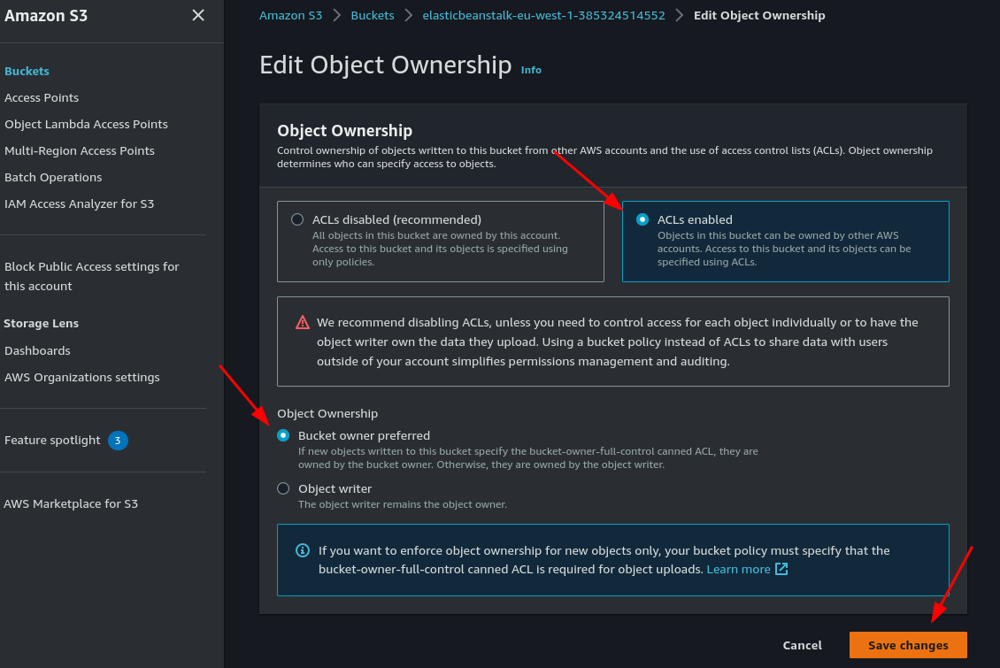


WebApp
---

**Retrieve the logs**
`eb logs --all`
It will download them locally under [ROOT_PROJECT/.elasticbeanstalk/logs/latest/]

The content of `eb-engine.log` shows all the initialisation operations :
- Retrieving the content of the S3 bucket.
- Downloading the application as a zip (uploaded with `eb create`) and extracting it.
- Installing Node.
- Installing the Node dependencies of the webapp.
- Starting the webapp.

**SSH log in to your new env**
```
eb ssh # Enter the passphrase of the SSH Key you created at "eb init"
ssh -i .ssh/aws-eb-re.pub ec2-user@34.252.159.221
```


**Show, stop and restart the webapp**
The node webapp is automatically started as a daemon with user `webapp`.

It also starts a nginx service listening on port 80 and redirect trafic to port 1337.

```
sudo su -i # Log to root

systemctl list-unit-files
cat /etc/systemd/system/web.service
systemctl status web.service
    # ● web.service - This is web daemon
    # Loaded: loaded (/etc/systemd/system/web.service; enabled; vendor preset: disabled)
    # Active: active (running) since Fri 2023-05-05 13:39:26 UTC; 2 days ago
    # Main PID: 31219 (npm start)
    # CGroup: /system.slice/web.service
    #      ├─31219 npm start
    #      └─31234 node src/app.js
#systemctl stop web

wget -nv -q -O - http://<YOUR_PUBLIC_IPV4_DNS>:1337 # i.e. http://ec2-34-252-159-221.eu-west-1.compute.amazonaws.com:1337
```

**To terminate the environment**
`eb terminate`


<!-- TODO clean -->

# Config env var
# https://stackoverflow.com/questions/11211007/how-do-you-pass-custom-environment-variable-on-amazon-elastic-beanstalk-aws-ebs


# https://docs.aws.amazon.com/elasticbeanstalk/latest/dg/configuring-https-elb.html